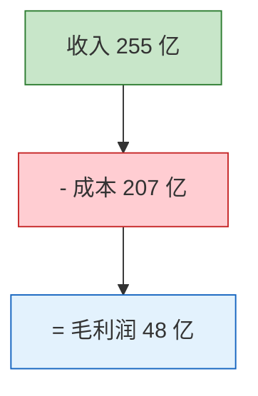

# Markdown 格式化输出

将用户提供的内容（文档、对话、笔记、分析等）整理为一份结构清晰、视觉精美、三端兼容的 Markdown 文件。

## 为什么这些规则重要

Markdown 渲染器之间差异很大。LaTeX 公式在 Typora 能渲染但 GitHub 不行，HTML 标签在 GitHub 能用但 Typora 可能显示原始代码，CDATA 是 XML 标记会污染文件。下面的规则确保输出在 Typora、GitHub、VS Code 三端都能正确渲染，不需要用户手动修复。

## 绝对禁止（输出前必须检查）

这些是导致返工的最常见问题，每一条都曾在实际使用中出错过：

1. **禁止 HTML 标签** — 不要用 `<div>`、`<span>`、`<br>`、`<center>`、`` 等任何 HTML 标签
2. **禁止 LaTeX 语法** — 不要用 `$$`、`$`、`\text{}`、`\frac{}`、`\boxed{}`、`\underbrace{}` 等
3. **禁止 CDATA 标记** — 不要出现 `<![CDATA[` 或 `]]>`
4. **禁止裸公式** — 所有数学表达式必须在代码块内，不能直接写在正文中

## 文件结构模板

```
# 标题

|  |  |
|:---:|:---:|
| **来源** | 具体来源信息 |
| **日期** | YYYY-MM-DD |
| **适用对象** | 目标读者 |

---

## 目录

- [一、章节名](#一章节名)
- [二、章节名](#二章节名)
...

---

## 一、章节名

内容...

---

## 二、章节名

内容...

---

*来源说明 | 日期*
```

## 公式展示规则

所有公式放在代码块中，用缩进对齐展示计算过程：

```
毛利率 = 毛利润 ÷ 收入 × 100%
       = 48.591 ÷ 255.326 × 100%
       = 19.0%
```

多个相关公式放在同一个代码块中，用空行分隔：

```
毛利润 = 收入 - 销售成本
营业利润 = 毛利润 - 研发费用 - SG&A - 其他营业费用
净利润 = 营业利润 ± 营业外收支 - 所得税
```

## Mermaid 图表规则

每个 Mermaid 图表的节点必须带颜色样式。配色语义：

- 正面/收入/盈利 → 绿色系：`fill:#C8E6C9,stroke:#2E7D32` 或 `fill:#4CAF50,color:#fff`
- 负面/支出/亏损 → 红色系：`fill:#FFCDD2,stroke:#c62828` 或 `fill:#f44336,color:#fff`
- 中性/过程/信息 → 蓝色系：`fill:#E3F2FD,stroke:#1565C0` 或 `fill:#2196F3,color:#fff`
- 警示/重要/转折 → 橙色系：`fill:#FFF3E0,stroke:#FF9800` 或 `fill:#FF9800,color:#fff`
- 核心/总结/关键 → 紫色系：`fill:#7B1FA2,color:#fff,stroke:#4A148C`

示例：



选择图表类型的原则：
- 流程/步骤/因果关系 → `flowchart TD` 或 `flowchart LR`
- 数据对比 → 优先用 Markdown 表格（更通用），复杂趋势才用 `xychart-beta`
- 占比/构成 → `pie`
- 分组对比 → `flowchart` + `subgraph`

## 表格规范

- 数字列居中：`:---:`
- 文字列左对齐：`------`
- 关键数据加粗

```markdown
| 指标 | 数值 | 变化 |
|------|:----:|:----:|
| 毛利率 | **19.0%** | +11.4pp |
```

## 内容增强手法

| 场景 | 用法 |
|------|------|
| 关键概念首次出现 | **加粗** |
| 类比/比喻解释 | `>` 引用块 |
| 重要警示 | `> **注意：**` 开头的引用块 |
| 多维度对比 | 表格 |
| 步骤/流程 | Mermaid flowchart |
| 术语定义 | 末尾附"概念速查表" |

## 输出前自检

完成文件后，逐条确认：

1. 用 grep 思维扫描：文件中是否有 `<div`、`<span`、`$$`、`\text{`、`\frac{`、`CDATA` → 如有，立即修复
2. 首行是否是 `# 标题`，无任何前缀字符
3. 末行是否干净，无 `]]>` 或其他标记残留
4. 每个 Mermaid 代码块是否都有 `style` 语句
5. 所有数学表达式是否都在 ``` 代码块内

## 输出指令

直接输出完整的 .md 文件内容，或使用 Write 工具保存到用户指定路径。不要输出"以下是文件内容"之类的前言，直接给文件。
