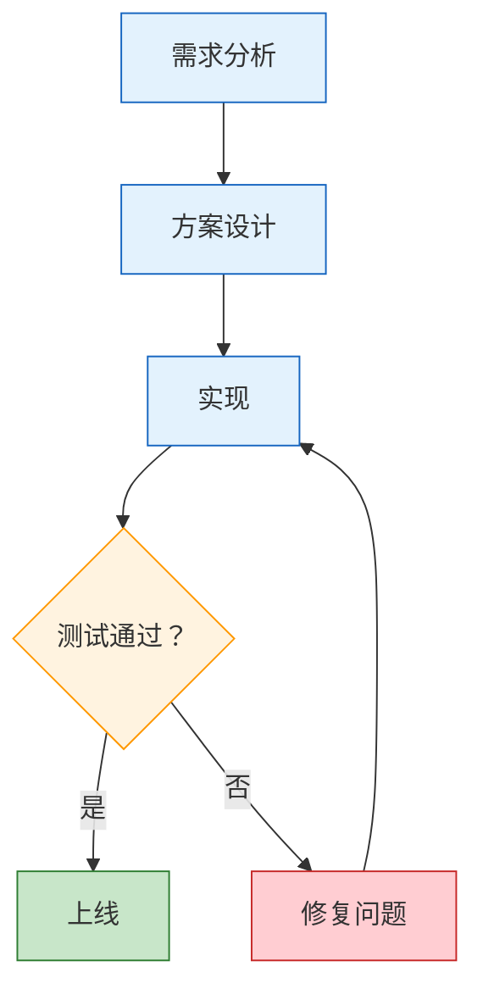

# Markdown 格式化输出

将用户提供的内容（文档、对话、笔记、分析等）整理为一份结构清晰、视觉精美、三端兼容的 Markdown 文件。

## 为什么这些规则重要

Markdown 渲染器之间差异很大。LaTeX 公式在 Typora 能渲染但 GitHub 不行，HTML 标签在 GitHub 能用但 Typora 可能显示原始代码，CDATA 是 XML 标记会污染文件。下面的规则确保输出在 Typora、GitHub、VS Code 三端都能正确渲染，不需要用户手动修复。

## 绝对禁止（输出前必须检查）

这些是导致返工的最常见问题，每一条都曾在实际使用中出错过：

1. **禁止 HTML 标签** — 不要用 `<div>`、`<span>`、`<br>`、`<center>`、`` 等任何 HTML 标签
2. **禁止 LaTeX 语法** — 不要用 `$$`、`$`、`\text{}`、`\frac{}`、`\boxed{}`、`\underbrace{}` 等
3. **禁止 CDATA 标记** — 不要出现 `<![CDATA[` 或 `]]>`
4. **禁止裸公式** — 所有数学表达式（包括计算结果）必须在代码块内，不能出现在正文、引用块、表格中。即使是简单的 `A = B` 或 `结果 = 12.6` 也必须放在代码块里

## 文件结构模板

```
# 标题

|  |  |
|:---:|:---:|
| **来源** | 具体来源信息 |
| **日期** | YYYY-MM-DD |
| **适用对象** | 目标读者 |

---

## 目录

- [一、章节名](#一章节名)
- [二、章节名](#二章节名)
...

---

## 一、章节名

内容...

---

## 二、章节名

内容...

---

*来源说明 | 日期*
```

## 公式展示规则

所有公式放在代码块中，用缩进对齐展示计算过程：

```
平均速度 = 总路程 ÷ 总时间
         = 120 km ÷ 2 h
         = 60 km/h
```

多个相关公式放在同一个代码块中，用空行分隔：

```
圆面积 = π × r²
圆周长 = 2 × π × r

球体积 = (4/3) × π × r³
球表面积 = 4 × π × r²
```

## Mermaid 图表规则

**重要：** `flowchart`、`graph` 类型的图表必须为每个节点添加 `style` 语句。`pie` 图表不支持 style 语句，可以直接使用。

配色语义：

- 正面/成功/完成 → 绿色系：`fill:#C8E6C9,stroke:#2E7D32` 或 `fill:#4CAF50,color:#fff`
- 负面/失败/风险 → 红色系：`fill:#FFCDD2,stroke:#c62828` 或 `fill:#f44336,color:#fff`
- 中性/过程/信息 → 蓝色系：`fill:#E3F2FD,stroke:#1565C0` 或 `fill:#2196F3,color:#fff`
- 警示/重要/注意 → 橙色系：`fill:#FFF3E0,stroke:#FF9800` 或 `fill:#FF9800,color:#fff`
- 核心/总结/关键 → 紫色系：`fill:#7B1FA2,color:#fff,stroke:#4A148C`

示例：



选择图表类型的原则：
- 流程/步骤/因果关系 → `flowchart TD` 或 `flowchart LR`（必须加 style）
- 数据对比 → 优先用 Markdown 表格（更通用），复杂趋势才用 `xychart-beta`
- 占比/构成 → `pie`（无需 style 语句）
- 分组对比 → `flowchart` + `subgraph`（必须加 style）

## 表格规范

- 数字列居中：`:---:`
- 文字列左对齐：`------`
- 关键数据加粗

```markdown
| 项目 | 数值 | 备注 |
|------|:----:|:----:|
| 参与人数 | **128** | 同比 +15% |
| 平均得分 | **82.5** | 满分 100 |
| 完成率 | **96%** | 目标 90% |
```

## 内容增强手法

| 场景 | 用法 |
|------|------|
| 关键概念首次出现 | **加粗** |
| 类比/比喻解释 | `>` 引用块（不能包含公式） |
| 重要警示 | `> **注意：**` 开头的引用块 |
| 多维度对比 | 表格 |
| 步骤/流程 | Mermaid flowchart |
| 优先级/等级标记 | **P0**、**P1**、**高优先级** 等加粗显示 |
| 术语定义 | 末尾附"概念速查表" |

## 输出前自检

完成文件后，逐条确认：

1. 用 grep 思维扫描：文件中是否有 `<div`、`<span`、`$$`、`\text{`、`\frac{`、`CDATA` → 如有，立即修复
2. 首行是否是 `# 标题`，无任何前缀字符
3. 末行是否干净，无 `]]>` 或其他标记残留
4. 每个 `flowchart`/`graph` 类型的 Mermaid 是否都有 `style` 语句（`pie` 图表除外）
5. 所有数学表达式（包括计算结果如 `X = 12.6`）是否都在 ``` 代码块内，没有出现在引用块、表格、正文中
6. 优先级标记（P0/P1/高优先级等）是否用 **加粗** 突出显示

## 输出指令

直接输出完整的 .md 文件内容，或使用 Write 工具保存到用户指定路径。不要输出"以下是文件内容"之类的前言，直接给文件。
