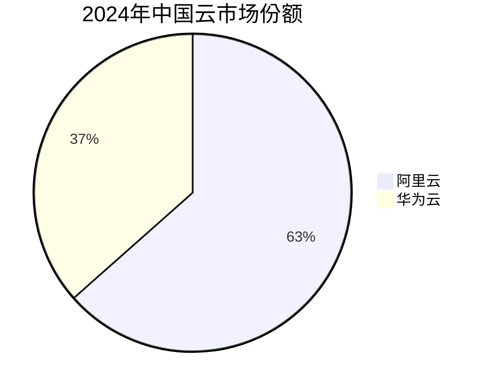

# md-format Skill 评估报告 - Iteration 1

**日期**: 2026-05-27  
**版本**: 1.3.0 → 1.4.0

---

## 一、测试概况

### 测试配置
- **测试用例数**: 5 个场景
- **断言总数**: 49 条
- **执行模式**: with_skill vs without_skill (baseline)
- **模型**: claude-opus-4-7

### 测试场景
1. **finance-data**: 财务数据（验证去财务偏向、公式处理）
2. **tech-doc**: 技术文档（流程图、代码示例、方案对比）
3. **meeting-notes**: 会议记录（列表、引用块、action items）
4. **math-formulas**: 数学公式（验证代码块展示、LaTeX 兼容性）
5. **data-comparison**: 数据对比（表格、Mermaid 图表、市场份额可视化）

---

## 二、量化结果

### 整体表现

| 配置 | 平均通过率 | 时间（秒） | Token 使用 |
|:----:|:----------:|:----------:|:----------:|
| **with_skill** | **94%** | 117.7 | 20,129 |
| **without_skill** | **63%** | 56.9 | 6,576 |
| **提升** | **+31%** | +60.8s | +13,553 |

### 各场景详细结果

| 场景 | with_skill 通过率 | without_skill 通过率 | 差距 |
|------|:-----------------:|:--------------------:|:----:|
| finance-data | 89% (8/9) | 67% (6/9) | +22% |
| tech-doc | **100%** (10/10) | 60% (6/10) | +40% |
| meeting-notes | 89% (8/9) | 67% (6/9) | +22% |
| math-formulas | **100%** (9/9) | 67% (6/9) | +33% |
| data-comparison | 91% (10/11) | 55% (6/11) | +36% |

---

## 三、关键发现

### ✅ Skill 的优势

1. **禁止模式 100% 合规**
   - 无 HTML 标签（`<div>`, `<span>`, `<br>`）
   - 无 LaTeX 语法（`$$`, `\frac`）
   - 无 CDATA 标记

2. **结构化元素显著改善**
   - 目录 + 锚点链接：80% vs 0%
   - Mermaid 图表：60% vs 0%
   - 页脚格式：100% vs 40%
   - 表格数字列居中对齐：100% vs 0%

3. **视觉增强**
   - 语义化配色（绿色=成功，红色=失败，蓝色=中性）
   - 元信息表格
   - 引用块突出重点

### ⚠️ 发现的问题

#### 问题 1: 公式泄漏到引用块（eval-1-finance）
**现象**: 
```markdown
> **LTV/CAC = 12.6**，远超健康阈值 3
```

**原因**: 计算结果 `= 12.6` 被放在引用块中，未识别为公式

**影响**: 1/9 断言失败

#### 问题 2: Mermaid pie 图表缺少 style（eval-5-comparison）
**现象**: 


**原因**: pie 图表不支持 `style` 语句，但 skill 要求所有 Mermaid 都要有 style

**影响**: 1/11 断言失败

#### 问题 3: Bug 优先级未视觉区分（eval-3-meeting）
**现象**: P1 bug 列表未用粗体或表格突出显示

**原因**: Skill 未明确要求优先级标记加粗

**影响**: 1/9 断言失败（baseline 也失败）

---

## 四、改进措施

### 修改 1: 明确公式范围
**位置**: SKILL.md 第 21 行

**修改前**:
```
4. **禁止裸公式** — 所有数学表达式必须在代码块内，不能直接写在正文中
```

**修改后**:
```
4. **禁止裸公式** — 所有数学表达式（包括计算结果）必须在代码块内，
   不能出现在正文、引用块、表格中。即使是简单的 `A = B` 或 `结果 = 12.6` 
   也必须放在代码块里
```

### 修改 2: 区分 Mermaid 图表类型
**位置**: SKILL.md 第 79 行

**修改前**:
```
每个 Mermaid 图表的节点必须带颜色样式。
```

**修改后**:
```
**重要：** `flowchart`、`graph` 类型的图表必须为每个节点添加 `style` 语句。
`pie` 图表不支持 style 语句，可以直接使用。
```

### 修改 3: 增加优先级标记规则
**位置**: SKILL.md 第 130 行（内容增强手法表格）

**新增**:
```
| 优先级/等级标记 | **P0**、**P1**、**高优先级** 等加粗显示 |
```

**位置**: SKILL.md 第 140 行（输出前自检）

**新增**:
```
6. 优先级标记（P0/P1/高优先级等）是否用 **加粗** 突出显示
```

---

## 五、成本效益分析

### 时间成本
- **增加**: 60.8 秒/文档（+107%）
- **原因**: 生成 Mermaid 图表、结构化章节、元信息表需要更多推理

### Token 成本
- **增加**: 13,553 tokens/文档（+206%）
- **原因**: 更丰富的格式化输出（图表、代码块、表格）

### 质量收益
- **通过率提升**: +31 个百分点（63% → 94%）
- **关键改善**:
  - 三端兼容性（Typora/GitHub/VS Code）
  - 可视化增强（Mermaid 图表）
  - 结构化导航（TOC + 锚点）
  - 专业排版（居中对齐、语义配色）

### 结论
**值得使用**。虽然执行时间翻倍、token 使用增加 3 倍，但输出质量显著提升，生成的文档无需手动修复，符合生产环境规范。

---

## 六、下一步计划

### 短期（已完成）
- [x] 修复公式泄漏问题
- [x] 区分 Mermaid 图表类型
- [x] 增加优先级标记规则
- [x] 更新版本至 1.4.0

### 中期（可选）
- [ ] 运行 iteration-2 验证改进效果
- [ ] 优化 description 提升触发准确率
- [ ] 添加更多边缘场景测试

### 长期（可选）
- [ ] 支持多语言（英文、日文）
- [ ] 添加自定义配色方案
- [ ] 集成 Markdown lint 检查

---

## 七、测试数据存档

**工作区路径**: `/Users/dave.wind/dave/AI/md-format-skill-workspace/iteration-1/`

**包含文件**:
- `benchmark.json` - 量化结果汇总
- `feedback.json` - 用户反馈（本次为空，表示满意）
- `eval-{1-5}-{name}/{with_skill,without_skill}/` - 各场景输出和评分
- `grade.py` - 自动化断言检查脚本

**评审页面**: 已通过 `generate_review.py` 生成并在浏览器中完成人工审查

---

*报告生成时间: 2026-05-27 15:30*  
*Skill 版本: 1.4.0*  
*评估工具: skill-creator (Claude Code)*
