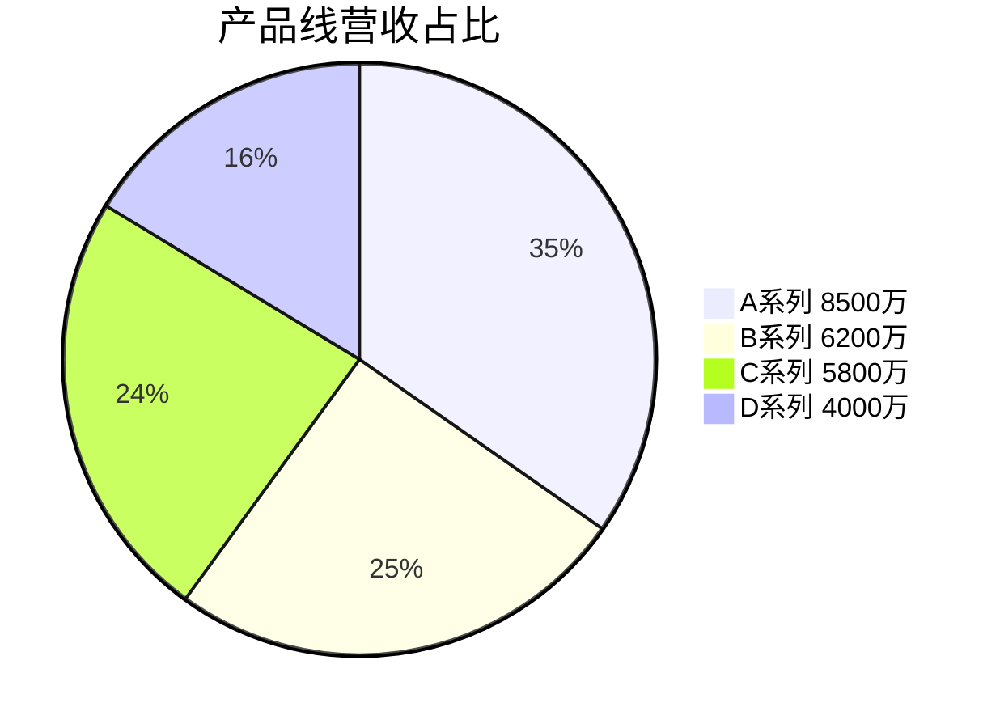
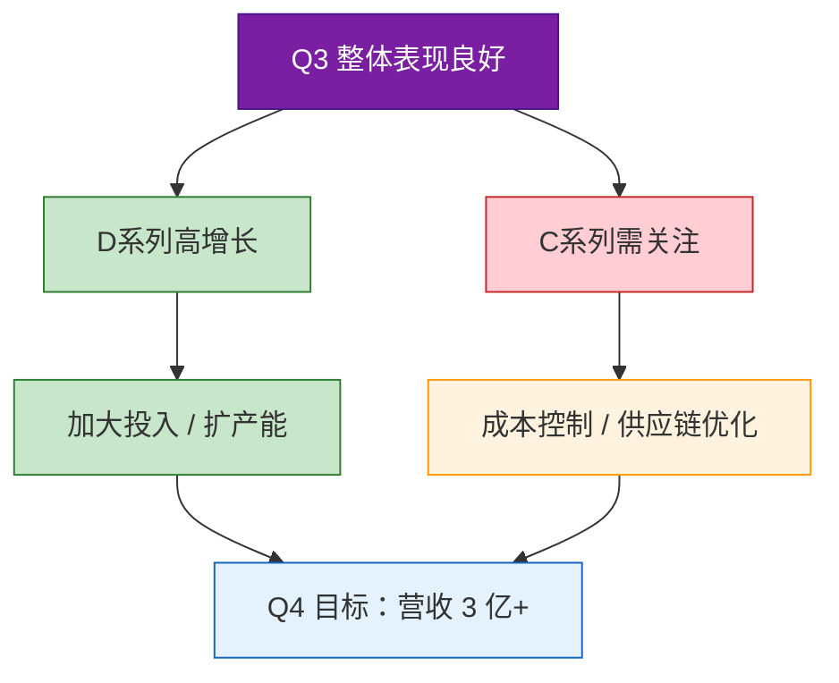

# 2024年Q3华东区销售分析

|  |  |
|:---:|:---:|
| **来源** | 华东区销售部 |
| **日期** | 2024-09-30 |
| **适用对象** | 管理层 / 销售团队 |

---

## 目录

- [一、总体情况](#一总体情况)
- [二、产品线表现](#二产品线表现)
- [三、关键指标](#三关键指标)
- [四、区域排名](#四区域排名)
- [五、结论与建议](#五结论与建议)

---

## 一、总体情况

本季度华东区**总营收 2.85 亿元**，同比增长 **12.3%**，环比增长 **5.7%**。

| 渠道 | 营收 | 占比 |
|------|:----:|:----:|
| 线上渠道 | **1.42 亿** | 49.8% |
| 线下渠道 | **1.43 亿** | 50.2% |

---

## 二、产品线表现

| 产品线 | 营收 | 毛利率 | 同比增长 | 备注 |
|--------|:----:|:------:|:--------:|------|
| A系列 | **8500 万** | 38.2% | **+18%** | 增长强劲 |
| B系列 | **6200 万** | 42.1% | +5% | 稳步增长 |
| C系列 | **5800 万** | 29.7% | **-3%** | 受原材料涨价影响 |
| D系列 | **4000 万** | 51.3% | **+22%** | 增速最快，毛利最高 |

> **注意：** C系列是唯一负增长产品线，原材料涨价是主因，需重点关注成本控制。



---

## 三、关键指标

### 3.1 客单价

```
客单价提升 = 385 - 326 = 59 元
增长率     = 59 ÷ 326 = 18.1%
```

| 指标 | Q2 | Q3 | 变化 |
|------|:--:|:--:|:----:|
| 客单价 | 326 元 | **385 元** | **+18.1%** |

### 3.2 复购率

**复购率 62.4%**，目标 60%，已达标。

### 3.3 获客成本与客户价值

```
新客获取成本 CAC = 总营销费用 ÷ 新客数
                 = 3200 万 ÷ 8.3 万
                 = 385.5 元/人

客户终身价值 LTV = 客单价 × 平均购买次数 × 生命周期
                 = 385 × 4.2 × 3
                 = 4851 元

LTV/CAC = 4851 ÷ 385.5
        = 12.6
```

> **LTV/CAC = 12.6**，远超健康阈值 3，说明获客投入回报优秀。

---

## 四、区域排名


---

## 五、结论与建议

| 方向 | 建议 |
|------|------|
| **D系列** | 同比 +22%、毛利率 51.3%，建议加大投入，扩大产能 |
| **C系列** | 同比 -3%，毛利率最低，需优化供应链、控制原材料成本 |
| **线上渠道** | 占比接近 50%，继续强化线上运营能力 |
| **复购率** | 已达标，可进一步提升至 65% 作为 Q4 目标 |



---

*华东区销售部 | 2024-09-30*
