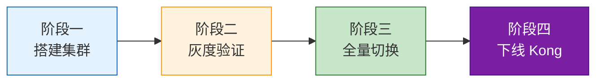

# 微服务网关升级方案 v2.0

|  |  |
|:---:|:---:|
| **来源** | 基础架构组 |
| **日期** | 2026-05-27 |
| **适用对象** | 后端开发 / 运维 / 架构师 |

---

## 目录

- [一、背景与现状](#一背景与现状)
- [二、方案选型对比](#二方案选型对比)
- [三、决策结论](#三决策结论)
- [四、迁移步骤](#四迁移步骤)
- [五、风险与应对](#五风险与应对)

---

## 一、背景与现状

当前 **Kong 网关**存在单点瓶颈，核心指标已触及红线：

| 指标 | 当前值 | SLA 要求 |
|------|:------:|:--------:|
| P99 延迟 | **280 ms** | < 200 ms |
| 日均请求量 | **1.2 亿次** | — |
| 峰值 QPS | **8500** | — |

> **注意：** P99 延迟已超出 SLA 40%，必须尽快完成网关升级。

---

## 二、方案选型对比

| 方案 | 性能 (P99) | 优势 | 劣势 |
|------|:----------:|------|------|
| Envoy + Istio | **50 ms** | 性能极佳 | 运维复杂度高，需 K8s 深度经验 |
| APISIX | **~55 ms** | 国产、社区活跃、插件丰富、学习曲线平缓 | 生态略逊于 Envoy |
| Kong Enterprise | — | 兼容现有配置，迁移成本低 | License 费用高（约 **45 万/年**） |

---

## 三、决策结论

**采用 APISIX**，核心理由：

1. 性能满足需求（P99 可控制在 SLA 范围内）
2. 团队学习成本低，上手快
3. 无 License 费用，长期成本优势明显

---

## 四、迁移步骤

| 阶段 | 时间 | 内容 |
|------|:----:|------|
| 阶段一 | 第 1-2 周 | 搭建 APISIX 集群，配置健康检查、限流、认证插件 |
| 阶段二 | 第 3 周 | 灰度切流 10% 内部服务验证 |
| 阶段三 | 第 4 周 | 全量切换，Kong 降级为备用 |
| 阶段四 | 第 5-6 周 | 监控稳定后下线 Kong |

---

## 五、风险与应对

| 风险项 | 说明 | 应对措施 |
|--------|------|----------|
| 插件兼容 | 现有自定义 Kong 插件需重写 | 用 Lua 重写为 APISIX 插件，提前排期 |
| 配置迁移 | 约 **200 条**路由规则需逐条验证 | 编写自动化校验脚本，人工抽检 |
| 回滚方案 | 切换后如出现问题需快速恢复 | 保留 Kong **30 天**，DNS 秒级切回 |

> **注意：** 回滚能力是本次迁移的安全底线，Kong 实例在观察期内不得释放资源。

---

*基础架构组 | 2026-05-27*
