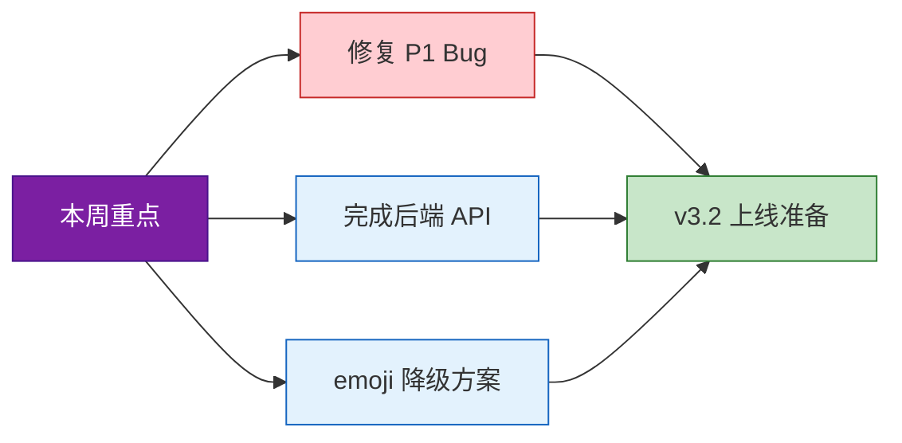

# 产品周会纪要

|  |  |
|:---:|:---:|
| **日期** | 2024-11-18 |
| **参会人** | 张明（产品）、李华（开发）、王芳（设计）、赵强（测试） |
| **类型** | 周例会 |

---

## 目录

- [一、v3.2 版本进度](#一v32-版本进度)
- [二、线上 Bug 处理](#二线上-bug-处理)
- [三、下周规划](#三下周规划)
- [四、Action Items](#四action-items)

---

## 一、v3.2 版本进度

**目标上线日期：12月5日**

| 模块 | 负责人 | 状态 | 说明 |
|------|:---:|:---:|------|
| 用户反馈 PRD | 张明 | **已完成** | 已发开发评审 |
| 后端 API | 李华 | **80%** | 剩余：消息推送、数据导出，预计周三完成 |
| 前端表单 | 前端 | 进行中 | 复杂度较高，可能延期 2 天 |
| 设计稿 | 王芳 | **已定稿** | 含暗黑模式适配 |
| 测试用例 | 赵强 | **已完成** | 共 218 条，自动化覆盖率 68%→目标 80% |

> **注意：** 新 emoji picker 在低端安卓机帧率仅 30fps，王芳建议做降级处理。

---

## 二、线上 Bug 处理

当前有 **3 个 P1 Bug** 需本周修复：

| 编号 | 问题描述 | 原因分析 | 紧急度 |
|:---:|------|------|:---:|
| 1 | iOS 端偶现闪退（复现率约 5%） | 怀疑内存泄漏 | 高 |
| 2 | 搜索结果排序错乱 | ES 索引未及时更新 | 高 |
| 3 | 第三方支付回调超时导致重复扣款 | 回调超时 | **最高** |

> **注意：** Bug #3 已影响 12 个用户，需退款处理。张明确认今天必须修复，李华下午立即处理。

---

## 三、下周规划

- 完成 v3.2 剩余开发
- 启动 v3.3 需求评审（重点：**AI 助手功能**）
- 安排一次线上压测（目标并发 **5000**）

---

## 四、Action Items

| 负责人 | 事项 | 截止时间 |
|:---:|------|:---:|
| 李华 | 修复支付 Bug | **今天** |
| 李华 | 完成剩余 API 接口 | **周三** |
| 王芳 | 输出 emoji 降级方案 | **周二** |
| 赵强 | 自动化覆盖率提升至 80% | **周五** |

---

---

*产品周会纪要 | 2024-11-18*
