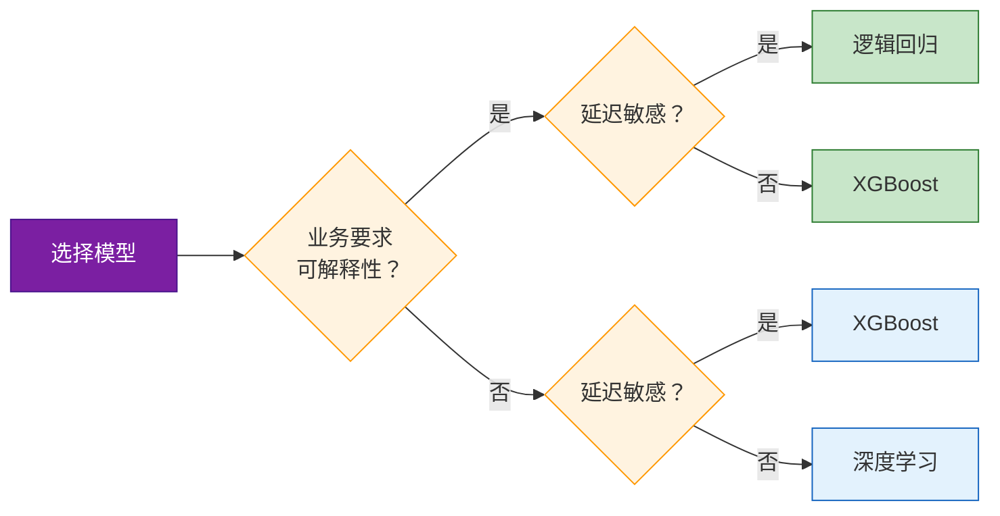

# 机器学习模型评估指标总结

|  |  |
|:---:|:---:|
| **主题** | 分类与回归模型评估指标 |
| **日期** | 2026-05-27 |
| **适用对象** | 机器学习工程师 / 数据科学家 |

---

## 目录

- [一、分类指标](#一分类指标)
- [二、类别不均衡问题](#二类别不均衡问题)
- [三、回归指标](#三回归指标)
- [四、模型对比（金融风控场景）](#四模型对比金融风控场景)
- [五、选择建议](#五选择建议)

---

## 一、分类指标

四个核心指标的计算公式：

```
Accuracy  = (TP + TN) / (TP + TN + FP + FN)
Precision = TP / (TP + FP)
Recall    = TP / (TP + FN)
F1 Score  = 2 × Precision × Recall / (Precision + Recall)
```

| 指标 | 含义 | 关注点 |
|------|------|--------|
| **Accuracy** | 整体预测正确的比例 | 各类别均衡时有效 |
| **Precision** | 预测为正的样本中真正为正的比例 | 关注"误报"成本 |
| **Recall** | 实际为正的样本中被正确检出的比例 | 关注"漏检"成本 |
| **F1 Score** | Precision 和 Recall 的调和平均 | 兼顾两者的综合指标 |

---

## 二、类别不均衡问题

> **注意：** 当类别不均衡时（如欺诈检测，正样本仅占 0.1%），**Accuracy 会产生严重误导**。

**反例演示** — 10000 个样本中仅 10 个正样本，模型全部预测为负：

```
Accuracy = 9990 / 10000 = 99.9%   （看似很高）
Recall   = 0 / 10       = 0%      （完全没检出）
```

> 这就像一个"什么都不做"的模型也能拿到 99.9% 准确率，但实际上毫无价值。在不均衡场景下应重点关注 **Precision**、**Recall** 和 **F1 Score**。

---

## 三、回归指标

```
MSE  = (1/n) × Sum(yi - yi_hat)²
RMSE = sqrt(MSE)
MAE  = (1/n) × Sum|yi - yi_hat|
R²   = 1 - Sum(yi - yi_hat)² / Sum(yi - y_mean)²
```

| 指标 | 特点 |
|------|------|
| **MSE** | 对大误差惩罚更重（平方项） |
| **RMSE** | 与原始数据同量纲，更直观 |
| **MAE** | 对异常值更鲁棒 |
| **R²** | 取值 0~1，越接近 1 拟合越好 |

> **R² 的含义：** 模型解释了多少比例的方差。R² = 0.85 意味着模型解释了 **85%** 的数据变异，剩余 15% 为未捕获的随机波动。

---

## 四、模型对比（金融风控场景）

| 模型 | AUC | 推理延迟 | 可解释性 |
|------|:---:|:--------:|:--------:|
| **逻辑回归** | 0.82 | 2 ms | 高 |
| **XGBoost** | 0.91 | 5 ms | 中等 |
| **深度学习** | **0.93** | 50 ms | 低 |



---

## 五、选择建议

- **要求可解释性**（如银行合规审查） → 选 **逻辑回归** 或 **XGBoost**
- **追求纯性能且延迟不敏感** → 选 **深度学习**
- **兼顾性能与延迟** → **XGBoost** 是最佳平衡点（AUC 0.91 / 5 ms）

---

*机器学习模型评估指标总结 | 2026-05-27*
