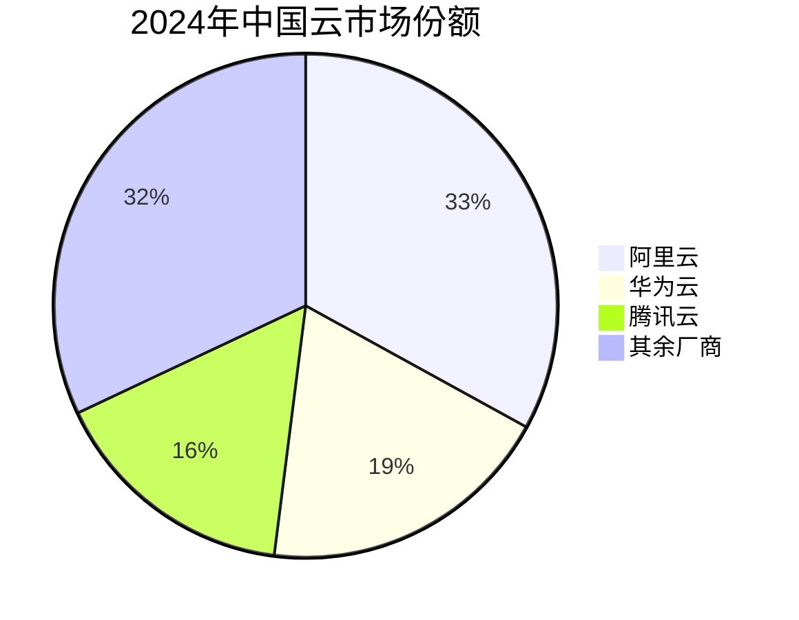
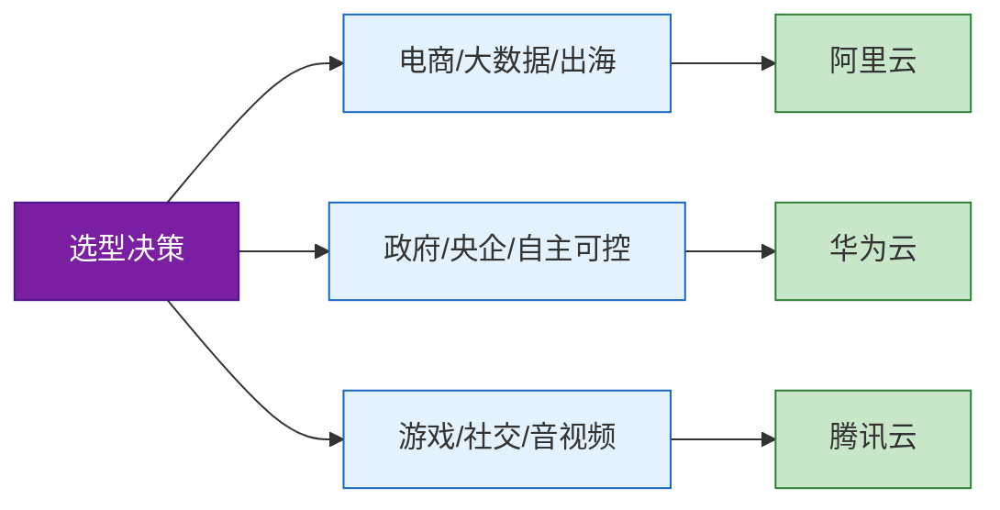

# 中国三大云厂商 2024 年对比

|  |  |
|:---:|:---:|
| **来源** | 行业分析整理 |
| **日期** | 2024 |
| **适用对象** | 云服务选型决策者、技术管理者 |

---

## 目录

- [一、市场份额](#一市场份额)
- [二、核心能力对比](#二核心能力对比)
- [三、价格对比](#三价格对比)
- [四、AI 能力对比](#四ai-能力对比)
- [五、数据库服务数量](#五数据库服务数量)
- [六、推荐场景](#六推荐场景)

---

## 一、市场份额



| 厂商 | 市场份额 |
|------|:---:|
| **阿里云** | **33%** |
| **华为云** | **19%** |
| **腾讯云** | **16%** |
| 其余厂商 | 32% |

---

## 二、核心能力对比

| 厂商 | 基因优势 | 核心差异化 | 生态亮点 |
|------|------|------|------|
| **阿里云** | 电商 | 大数据生态最完善（MaxCompute、DataWorks） | 国际化布局最广（29 个 region） |
| **华为云** | 政企 | 自研芯片昇腾 + 鲲鹏 | 混合云方案成熟 |
| **腾讯云** | 社交/游戏 | 音视频能力突出（TRTC） | 与微信生态深度整合 |

---

## 三、价格对比

> **注意：** 以 4C8G 通用型实例为例，实际价格因地域和促销活动可能有所变动。

| 厂商 | 按月价格 | 按年价格 | 年付折扣 |
|------|:---:|:---:|:---:|
| **阿里云** | 398 元 | 3,980 元 | **83 折** |
| **华为云** | 385 元 | 3,696 元 | **80 折** |
| **腾讯云** | 375 元 | 3,600 元 | **80 折** |

```
年度成本节省（相对按月付费）：
  阿里云：398 × 12 - 3980 = 796 元/年
  华为云：385 × 12 - 3696 = 924 元/年
  腾讯云：375 × 12 - 3600 = 900 元/年
```

---

## 四、AI 能力对比

| 厂商 | 大模型 | AI 平台/算力 |
|------|------|------|
| **阿里云** | 通义千问系列（开源） | 百炼平台 |
| **华为云** | 盘古大模型 | 昇腾 AI 算力 |
| **腾讯云** | 混元大模型 | 游戏 AI 特色场景 |

---

## 五、数据库服务数量

| 厂商 | 数据库服务数量 |
|------|:---:|
| **阿里云** | **15 种** |
| **华为云** | **12 种** |
| **腾讯云** | **10 种** |

---

## 六、推荐场景



| 场��� | 推荐厂商 |
|------|------|
| 电商 / 大数据 / 出海 | **阿里云** |
| 政府 / 央企 / 自主可控 | **华为云** |
| 游戏 / 社交 / 音视频 | **腾讯云** |

---

*行业分析整理 | 2024*
